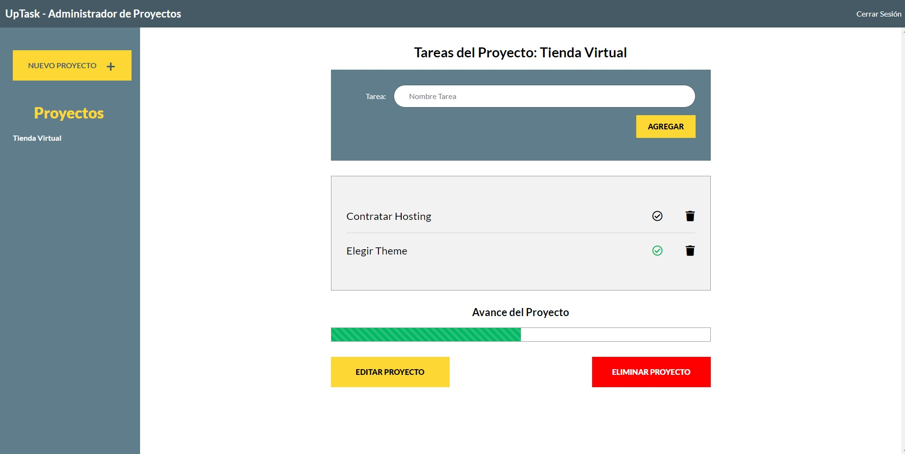

# App para manejar proyectos y tareas, realizada con Node y MVC

- Crear las variables de entorno (variables.env):

BD_NOMBRE=

BD_USER=

BD_PASS=

BD_HOST=

BD_PORT=

HOST=

- Para comenzar ejecute:
`npm install`

- Instalar webpack:
`npm i --dev webpack`

- Instalar concurrently:
`npm i --save concurrently`

- Para ejecutar en desarrollo:
`npm run desarrollo`

## Vista Previa:

